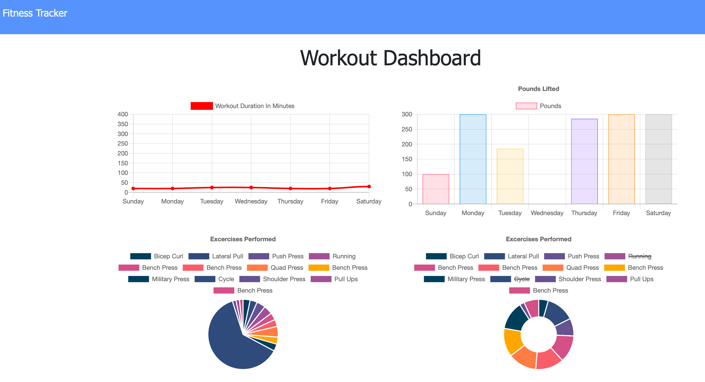
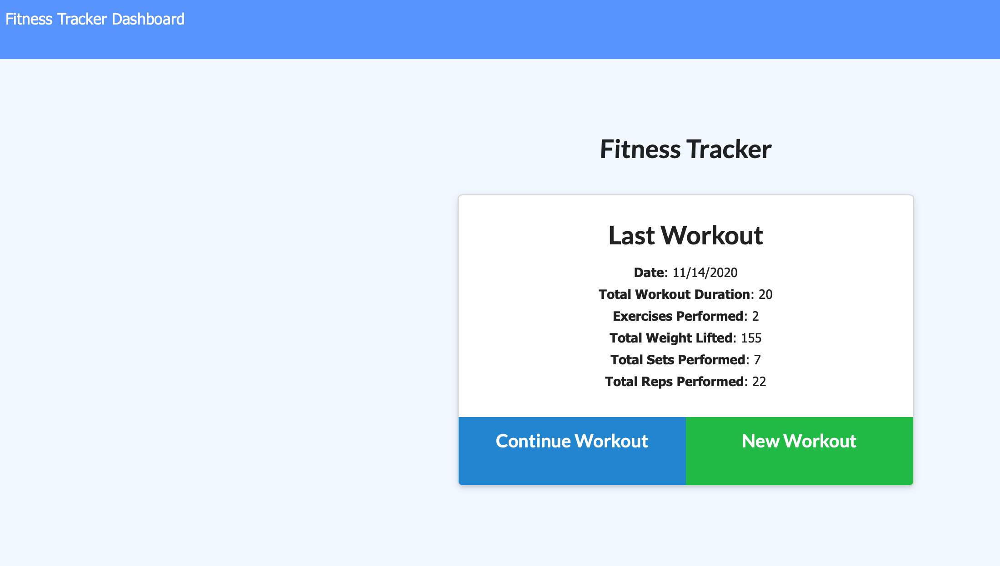
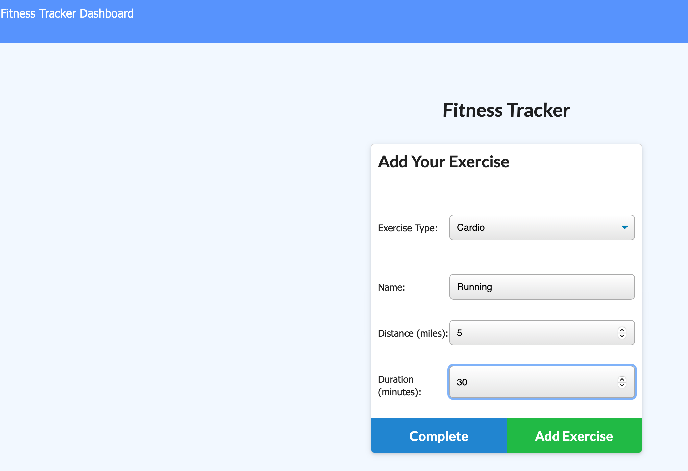

 
# Project name : FITNESS TRACKER
## Live project site can be acces here: 	[HW-17 Fitness Tracker](https://boiling-dawn-12476.herokuapp.com/)

## Project Repo [hw17-fitness_tracker](https://github.com/trilambda122/hw17-fitness_tracker)

---
## Table of Contents

[Description](#description)...

[Installation Requirements](#installtion-requirments)...

[Useage](#useage)...

[License](#License)...

[Contribitors](#Contribitors)...

[Tests](#Tests)...

[Questions](#Questions)...

[Application Screen Shots](#ScreenShots)...

---
## Description
Simple fitness tracking application that stores data in a mongdb database, and uses chartjs to graph your resutls.

---

## Installtion requirments
npm install

---
## Useage
npm start

---
## License
NOTICE This application is covered under MIT License license.
Please see license.md file for more information 

---
## Contribitors 

Shane Schilling

---
## Tests

---
## Questions

Github profile can be found here:  http://github.com/trilambda122

Please direct any additonal questions to: shane@sschilling.com

---
## ScreenShots

*SCREEN SHOT 1*
*SCREEN SHOT 2*
*SCREEN SHOT 3*

